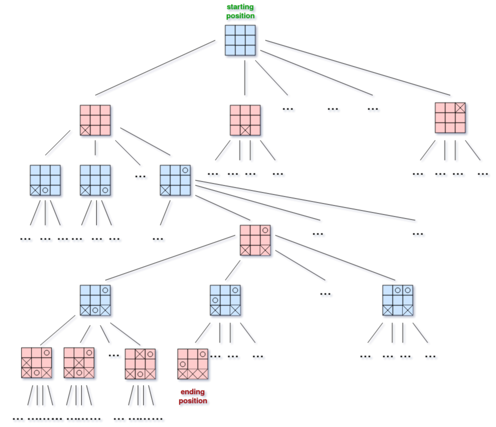

# Tic-Tac-Toe

This project consists of the implementation of an epsilon-greedy algorithm, to train an agent to play a game of Tic-Tac-Toe.

## Introduction
The main objective of this exercise consists on the implementation of a Tic-Tac-Toe game in **python**, as well as the implementation of an agent that, through reinforcement learning techniques (in this case an epsilon-greedy algorithm), will be able to develop a strategy to play the game. To prove the efficiency of the algorithm, the strategy developed by the agent should obtain results superior to a random approach.

## The Game

The game implemented consists of a simple 3x3 Tic-Tac-Toe game. There are 2 players: **X** and **O**, that take actions alternatively.

The rules of this game can be defined by legal positions (or legal states) and legal moves for every legal position. For every legal position it is possible to effectively determine all the legal moves. Some of the legal positions are starting positions and some are ending positions.

The best way to describe these terms is using a tree graph whose nodes are legal positions and whose edges are legal moves. The graph is directed since it does not necessarily mean that we'll be able to move back exactly where we came from in the previous move, e.g. in chess a pawn can only go forward. This graph is called a game tree. Moving down the game tree represents one of the players making a move, and the game state changing from one legal position to another.

Here's an illustration of a game tree for a Tic-Tac-Toe game: [[1]](#minmaxABP)

## Reinforcement Learning

There are five main components of a RL system:

* **Agent**: the agent is the AI that will be playing the game. The algorithm will be programmed into the agent so that it can "learn" the game;
* **Environment**: the environment is what the agent interacts with. In this case, the environment will be an object that models the Tic-Tac-Toe game;
* **State**: the state is the specific configuration of the environment that the agent is sensing. While the environment consists of all possible states of the game, the states itself involves only what the agent can sense or knows in a given point in time;
* **Action**: is what the agent can do that will affect the environment. In Tic-Tac-Toe that is placing a piece on the board. Performing and action always takes the agent to a new state, which also comes with a possible reward. The **value function** determines which action the agent will take in a given state;  
* **Reward**: rewards tell "how good" an action was, not whether it was correct or incorrect. It is important to note that rewards gotten over the course of an agent existence do not necessarily represent rewards it could get in the future. For example, if an agent searches a bad part of state space, it could hit the local maximum of **10pts**, but the environment global maximum could be **1000pts**.

## The Algorithm
 For modeling the agent and the environment a few considerations were made: 

 * For the simplicity of the algorithm, when modeling the environment every single combination of cells was mapped as a possible state, even when said stated would never be reached in a game. For example a state where all cells where marked with an X.
 * The game was considered over when all cells where filled or a player had placed its piece in three consecutive cells in any direction. The "impossible" states mentioned above were ignored and its winners calculated as normal since it would not affect the training if they will never be reached.
 * For each possible state it was assigned a default reward:
 	+ reward = 1 for the states where the game was over and the agent had won;
 	+ reward = -1 for the states where the game was over and the agent had lost;
 	+ reward = 0.5 for the states where the game had ended in a draw;
 	+ reward = 0 for the states where the game was not over.

### The Value Function
The objective of the agent is maximize all future rewards, and not the rewards of the next action. For example, there could be a state where if the agent could make a move **a** and end the game in a draw, or the move **b** and keep playing. If we were to choose the state with the best reward we would pick **a** over **b**, since continuing the game has a reward of 0, which is worse than the 0.5 that a draw would get. However, if the agent continues to play, he may be able to win and therefore get an ultimate reward of 1, which would be superior than a draw.

The scenario above may not happen with this particular game, but it demonstrate the importance of valuing the final reward over than the current reward. That's where the value function comes in. This function estimates the value by taking into account the probability of all possible future rewards.

The value function used in this algorithm can be given by:

	V(s) = V(s) + alpha*(V(s')-V(s)) 

where `V(s)` is the value function of the state `s`, `s'` is the next state and `alpha` is the learning rate of the algorithm.

## Conclusions

It is important to note that, in many cases, computing every single state and what the agent should do for each one is ludicrous. For a simple game like Tic-Tac-Toe, there are a total of  states. If you increase the number of rows of columns the number of states increases exponentially. A 4x4 game would imply in over 43 million different states. In this exercise, we initialized the value function with a default value for each possible state. However for any game that is slightly more complex than a 3x3 Tic-Tac-Toe, this approach would be computationally inviable. Therefore, an algorithm that can help the agent learn and develop a strategy to play the game without the need to map every possible state would be necessary in such cases.

## References
<a id="minmaxABP">[1]</a> 
[Minimax with Alpha-Beta Pruning in Python](https://stackabuse.com/minimax-and-alpha-beta-pruning-in-python/)